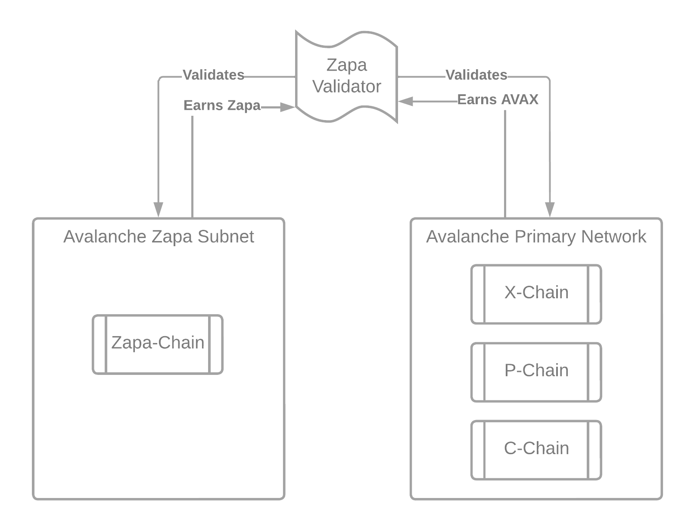

# ZAPA Tokenomics

ZAPA is the native coin of the Zapa subnet. All transactions strictly involve the sending and receiving of ZAPA. 
It's possible other chains will exist in the future for transacting other assets privately, but as of this writing,
ZAPA is the only coin which gets transacted on the ZAPA subnet

## Overview

Zapa is an Avalanche subnet, and as a consequence, Zapa maintains independent state from the Avalanche primary network chains while sharing common validators with 
the primary network chains. See [Subnet FAQ](https://support.avax.network/en/articles/6158840-subnet-faq) for more information on Avalanche subnets.

Above is a view into how a Zapa validator fits into the overall network. Each Zapa validator must also validate the Avalanche primary network. As a reward
for also validating the Zapa chains, Zapa validators earn ZAPA detailed below.

## Validator Rewards

Validator rewards are divided into two components, transaction fees and a block reward for producing a block. Each ZAPA transaction has a flat fee of 0.00001 ZAPA. Currently, each
block producer receives a reward of 10 ZAPA. Currently, supply is capped at 21 million ZAPA with a descending block reward structure. 

## Contributor Incentives

Zapa plans on launching an incentive structure for helping to advance the project. This exact structure and amounts are yet to be decided, but here
are tasks that will be rewarded:

- Development: accomplishing or contributing to the accomplishment of any github issue
- Bug Bounties: discovering and documenting deffeciencies in the software
- Testnet Validation: validating the chain on Fuji
